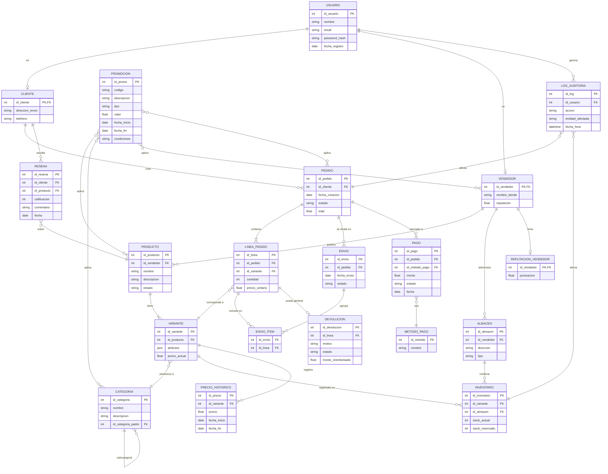

## Marketplace + Logística (ventas, proveedores, stock, envíos, devoluciones, promociones)

1. La plataforma es un **marketplace** donde **Vendedores** ponen a la venta **Productos** y **Clientes** compran.
2. Un **Usuario** puede ser ​**Cliente**​, **Vendedor** o ambos (modelo con subtipos).
3. Los **Productos** tienen **variantes** (p. ej. talla, color) y pertenecen a una **Categoría** jerárquica (categoría → subcategoría → …).
4. Cada **Producto/Variante** mantiene **inventario** por **Almacén** (multi-warehouse).
5. Los **Vendedores** pueden tener **múltiples almacenes** u ofrecer “dropshipping” (stock en proveedor).
6. Un **Pedido** es creado por un Cliente y puede contener múltiples **Líneas de pedido (order items)** (cada item apunta a una variante de producto).
7. Un **Pedido** puede dividirse en ​**varios envíos (Shipments)**​; un envío agrupa uno o varios items y tiene ​**estado de envío**​.
8. El sistema registra **Pagos** (posibles múltiples intentos, reembolsos parciales) y ​**Método de pago**​.
9. Existencia de ​**Devoluciones**​: se registra devolución por línea, motivo, estado y posible **nota de crédito** o reembolso.
10. **Promociones / Cupones** aplicables por producto, categoría, vendedor o pedido (fechas de validez, condiciones mínimas).
11. **Reseñas** y **Valoraciones** de producto por clientes, y ​**reputación de vendedor**​.
12. **Historial de precios** (price history) para cada variante — interesa para auditoría y análisis.
13. **Reglas de negocio** importantes: reserva de stock cuando se crea pedido; cancelación en ventana X minutos; bloqueo de envío si stock insuficiente; máximos de compra por cliente por producto (ej.: 5 unidades).
14. Registro de ​**logs de auditoría**​: quién creó/actualizó pedidos, cambios de stock críticos.
15. **Reportes** frecuentes: ventas por día/region/vendedor, productos sin stock, pedidos pendientes de pago.

## Paso 1 – Identificación de Entidades

* **USUARIO**: actor del sistema (base).  
* **CLIENTE**: subtipo de usuario comprador.  
* **VENDEDOR**: subtipo de usuario que ofrece productos.  
* **PRODUCTO**: artículo publicado.  
* **VARIANTE**: versión específica de un producto (talla, color).  
* **CATEGORIA**: jerarquía de clasificación de productos.  
* **ALMACEN**: ubicación física (propio o dropshipping).  
* **INVENTARIO**: registro de stock por variante y almacén.  
* **PEDIDO**: orden creada por un cliente.  
* **LINEA_PEDIDO (OrderItem)**: item dentro de un pedido.  
* **ENVÍO (Shipment)**: agrupación de líneas con estado.  
* **PAGO**: registro de pago de pedido.  
* **METODO_PAGO**: forma de pago (tarjeta, PayPal, etc.).  
* **DEVOLUCION**: devolución de una línea de pedido.  
* **PROMOCION / CUPON**: descuentos aplicables.  
* **RESEÑA**: valoración de producto por cliente.  
* **REPUTACION_VENDEDOR**: puntuación agregada.  
* **PRECIO_HISTORICO**: historial de precios por variante.  
* **LOG_AUDITORIA**: registro de cambios y operaciones críticas.  

---

## Paso 2 – Relaciones y Verbos

* **Usuario — Cliente/Vendedor**  
  * `Usuario (1) — especializa — (0..1) Cliente`  
  * `Usuario (1) — especializa — (0..1) Vendedor`  
  * Permite que un usuario sea ambos.  

* **Vendedor — Producto**  
  * `Vendedor (1) — publica — (0..N) Producto`  
  * Cardinalidad: 1:N  

* **Producto — Variante**  
  * `Producto (1) — tiene — (1..N) Variante`  
  * Cardinalidad: 1:N  

* **Producto/Variante — Categoria**  
  * `Variante (N) — pertenece a — (1) Categoria`  
  * `Categoria (1) — puede tener — (0..N) Subcategorias`  
  * Jerarquía recursiva N:1  

* **Variante — Inventario — Almacén**  
  * `Variante (N) — registrado en — (N) Almacén`  
  * Relación N:M materializada como **Inventario** (con stock, reservado).  

* **Cliente — Pedido**  
  * `Cliente (1) — crea — (0..N) Pedido`  
  * Cardinalidad: 1:N  

* **Pedido — Línea de pedido**  
  * `Pedido (1) — contiene — (1..N) LineaPedido`  
  * Cardinalidad: 1:N  

* **LineaPedido — Variante**  
  * `LineaPedido (N) — corresponde a — (1) Variante`  
  * Cardinalidad: N:1  

* **Pedido — Envío**  
  * `Pedido (1) — se divide en — (1..N) Envío`  
  * Cardinalidad: 1:N  

* **Envío — LíneaPedido**  
  * `Envío (1) — agrupa — (1..N) LineaPedido`  
  * Cardinalidad: N:M (un ítem puede ir en un envío, requiere tabla intermedia `Envio_Item`)  

* **Pedido — Pago**  
  * `Pedido (1) — asociado a — (0..N) Pago`  
  * Cardinalidad: 1:N  

* **Pago — MetodoPago**  
  * `Pago (N) — utiliza — (1) MetodoPago`  
  * Cardinalidad: N:1  

* **LineaPedido — Devolucion**  
  * `LineaPedido (1) — puede generar — (0..1) Devolucion`  
  * Cardinalidad: 1:0..1  

* **Promocion — Producto / Categoria / Vendedor / Pedido**  
  * Relaciones N:M:  
    * `Promocion (N) — aplica a — (N) Producto`  
    * `Promocion (N) — aplica a — (N) Categoria`  
    * `Promocion (N) — aplica a — (N) Vendedor`  
    * `Promocion (N) — aplica a — (N) Pedido`  

* **Cliente — Reseña — Producto**  
  * `Cliente (1) — escribe — (0..N) Reseña`  
  * `Reseña — sobre — (1) Producto`  

* **Vendedor — Reputacion**  
  * `Vendedor (1) — tiene — (0..1) Reputacion`  

* **Variante — PrecioHistorico**  
  * `Variante (1) — registra — (0..N) PrecioHistorico`  

* **LogAuditoria**  
  * Se relaciona con cualquier operación crítica (ej. cambios en pedidos, stock). 

---

## Paso 4 – Identificadores

### Usuario
* id_usuario (PK)  
* nombre  
* email  
* password_hash  
* fecha_registro  

### Cliente
* id_cliente (PK, FK a Usuario)  
* direccion_envio  
* telefono  

### Vendedor
* id_vendedor (PK, FK a Usuario)  
* nombre_tienda  
* reputacion (opcional, redundante si hay tabla agregada)  

### Producto
* id_producto (PK)  
* id_vendedor (FK)  
* nombre  
* descripcion  
* estado (activo/inactivo)  

### Variante
* id_variante (PK)  
* id_producto (FK)  
* atributos (JSON: talla, color, etc.)  
* precio_actual  

### Categoria
* id_categoria (PK)  
* nombre  
* descripcion  
* id_categoria_padre (FK, recursiva)  

### Almacen
* id_almacen (PK)  
* id_vendedor (FK, opcional si es proveedor externo)  
* direccion  
* tipo (propio / dropshipping)  

### Inventario
* id_inventario (PK)  
* id_variante (FK)  
* id_almacen (FK)  
* stock_actual  
* stock_reservado  

### Pedido
* id_pedido (PK)  
* id_cliente (FK)  
* fecha_creacion  
* estado (pendiente, pagado, cancelado, enviado)  
* total  

### LineaPedido
* id_linea (PK)  
* id_pedido (FK)  
* id_variante (FK)  
* cantidad  
* precio_unitario  

### Envio (Shipment)
* id_envio (PK)  
* id_pedido (FK)  
* fecha_envio  
* estado (pendiente, en tránsito, entregado)  

### Pago
* id_pago (PK)  
* id_pedido (FK)  
* id_metodo_pago (FK)  
* monto  
* estado (exitoso, fallido, reembolsado)  
* fecha  

### MetodoPago
* id_metodo (PK)  
* nombre  

### Devolucion
* id_devolucion (PK)  
* id_linea (FK)  
* motivo  
* estado  
* monto_reembolsado  

### Promocion
* id_promo (PK)  
* codigo  
* descripcion  
* tipo (porcentaje, monto fijo)  
* valor  
* fecha_inicio  
* fecha_fin  
* condiciones  

### Reseña
* id_resena (PK)  
* id_cliente (FK)  
* id_producto (FK)  
* calificacion (1–5)  
* comentario  
* fecha  

### PrecioHistorico
* id_precio (PK)  
* id_variante (FK)  
* precio  
* fecha_inicio  
* fecha_fin  

### LogAuditoria
* id_log (PK)  
* id_usuario (FK)  
* accion  
* entidad_afectada  
* fecha_hora  

---

## Paso 5 – Jerarquías de Generalización

* **USUARIO → CLIENTE / VENDEDOR** (subtipos, un usuario puede ser ambos)  
* **PRODUCTO → VARIANTE** (especialización en atributos, talla/color)  
* **CATEGORIA → subcategoría** (jerarquía recursiva)  
* **PEDIDO → ENVÍOS / PAGOS / DEVOLUCIONES** (estructura compuesta)
---

